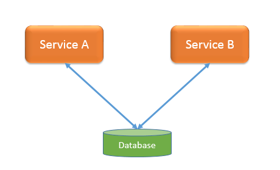
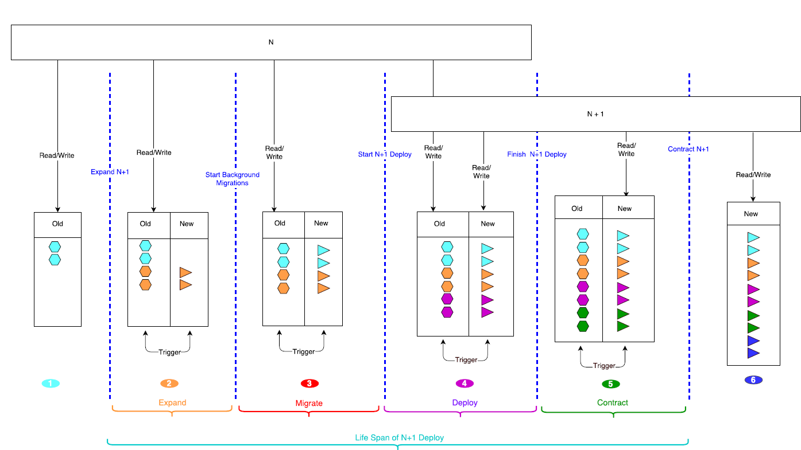

## Rolling-Upgrade [Part 2]

Trong seri tiếp theo của chủ đề **Rolling upgrade** tôi sẽ phân tích về tám tính năng mà một project cần được hỗ trợ để được công nhận có tính năng Rolling upgrade.

--------------------------------
 
### 1. Online Schema Migration 
Cho phép thay đổi lược đồ cơ sở dữ liệu mà **không** yêu cầu tắt hết dịch vụ (không hỗ trợ thay đổi về phiên bản cũ hơn).
Lược đồ cơ sở dữ liệu ở đây ta có thể hiểu là database của một service. Hãy thử hình dung rằng trong phiên bản kế tiếp database đã bị thay đổi như thêm cột/bảng, xóa cột/bảng, hoặc sửa lại tên cột/bảng. Vậy làm thế nào mà ta có thể upgrade database lên phiên bản kế tiếp mà không phải tắt hết tất service cùng một lúc rồi bật, đúng là một bài toán khó đúng không các bạn đọc :). Nhưng không sao, khó đến mấy chúng ta cũng phải làm bằng được, nếu khó quá thì mạnh dạn bỏ qua :-). Và có một lời giải cho bài toán này là sử dụng tính năng **“trigger”** trong database và cụ thể trong Openstack đã có Keystone và Glance sử dụng tính năng này để thực hiện việc **Rolling upgrade**. 

Vậy **“trigger”** là gì: Trigger được dùng để thực hiện một hành động như tạo xóa bản ghi trước hoặc sau khi thực hiện một hành động nào đó trong database.
*Ví dụ*: ta có thể tạo ra một trigger để trước khi ghi một bản ghi vào trong table A thì tạo một bản ghi vào trong table B.
Bây giờ tôi sẽ lấy một đầu bài và xin các bạn hay **luôn nhớ** nó trong quá trình đọc bài này để có thể hiểu xuyên suốt nhé:
Bài toán: Database của một service tại phiên bản N có một bảng tên là “old” nhưng sang database tại phiên bản N+1 đã bị xóa và thay thế bằng bảng mới tên là “new”. Vậy làm thế nào để người dùng service đó tại phiên bản N có thể *rolling upgrade* lên phiên bản (N+1).
 
Lời giải chính là việc tôi sẽ phân tích từng giai đoạn để các bạn có thể thấy được không có thời điểm nào mà service xung đột với database

Trong quá trình rolling upgrade database sử dụng trigger ta sẽ có 3 pha chính:
- Expand: dùng để thêm cột, bảng, trigger trong database.
- Migrate: dùng để di chuyển dữ liệu từ cũ sang mới.
- Contract: dùng xóa cột, bảng, trigger trong database.

Hãy thử hình dung rằng có 2 services (A và B) cùng tương tác với database:

Và quá trình upgrade sử dụng trigger như sau:

- Pha (1): Chuẩn bị upgrade.

Khi 2 services đang chạy tại phiên bản N thì chúng đều tương tác với “old” table.

- Pha (2): Expand database

Lúc này DB sẽ có “new” table và trigger. Nếu trên A và B tạo ra các bản ghi ở “old” table thì trigger sẽ làm nhiệm vụ copy nội dung cần thiết của bản ghi đó sang “new” table.
Hình màu da cam là thể hiện các dữ liệu được tạo ra tại expand phase

- Pha (3) Migrate database.

Copy toàn bộ dữ liệu ở “old” table trước thời điểm tạo trigger sang “new” table. Nghĩa là hình có màu xanh da trời sẽ được chuyển sang “new” table.
Kết quả là “old” table và “new” table đều có nội dung tương đương nhau và các service vẫn đọc ghi vào trong “old” table và ngay lập tức cũng được trigger copy sang “new” table

- Pha (4) Deploy phase:

Nhờ có tính năng rolling upgrade mà tao không phải upgrade 2 service cùng một thời điểm mà ta có thể làm lần lượt:
 
*Thời điểm 1:* Upgrade service A lên phiên bản (N+1):
A sẽ đọc ghi vào “new” table, và khi tạo ra một bản ghi mới ở “new” table thì cũng sẽ được trigger copy sang “old” table.
Đối với B thì vẫn đọc tại “old” table và nếu ghi vào “old” table thì cũng được trigger copy sang “new” table.
 
*Thời điểm 2:* Upgrade service B lên phiên bản (N+1):
Lúc này tất cả các serivice đã được upgrade lên (N+1)
 
- Pha (5) Contract phase:

Sau khi đã upgrade toàn bộ serivce lên (N+1) thì “old” table sẽ không được đọc ghi bởi bất kì service nào nữa, tất cả đã chuyển sang đọc ghi “new” table
Thực hiện contract phase sẽ xóa trigger và xóa “old” table
 
- (6) Pha hoàn thành

Chúng ta đã hoàn thành quá trình upgrade hệ thống sử dụng trigger để xử lý vấn đề thay đổi database. Các bạn cũng thấy rằng trong suốt quá trình rolling upgrade thì service ở phiên bản cũ hay phiên bản mới đều có thể tương tác với DB để tránh việc downtime cho người dùng rồi chứ.
 
Tiếp theo tôi sẽ phân tích tính năng thứ hai là

### 2.Maintenance Mode
 Là chế độ đặt một node vào trạng thái duy trì, bảo hành sửa chữa để cho hệ thống không đặt resources trên node đó nữa khi có yêu cầu từ người dùng tạo mới resources. Tôi sẽ lấy một ví dụ cụ thể để mà một project đã tích hợp tính năng này vào đó chính là Nova.

 Trong Nova có các thành phần như: nova-api, nova-conductor, nova-scheduler, nova-compute,...

Trong đó: 
- nova-compute dùng để tạo ra các máy ảo, vậy máy ảo ở đây chính là resource.
- nova-scheduler sẽ làm nhiệm vụ tính toán để đặt con máy ảo trên nova-compute nào cho phù hợp. 

Vậy câu chuyện là khi người vận hành muốn bảo trình một node nova-compute 30 thì đâu tiên họ phải ra lệnh cho nova kích hoạt chế độ **maintenance mode** cho node nova-compute 30 lên, lúc đó nova-scheduler sẽ sẽ đặt máy ảo trên node nova-compute 30 nữa kể cả tài nguyên trên đó vẫn còn rất nhiều khi có yêu cầu từ người dụng tạo máy ảo. 
=> Đó chính là ý nghĩa của tính năng **Maintenance Mode**.

